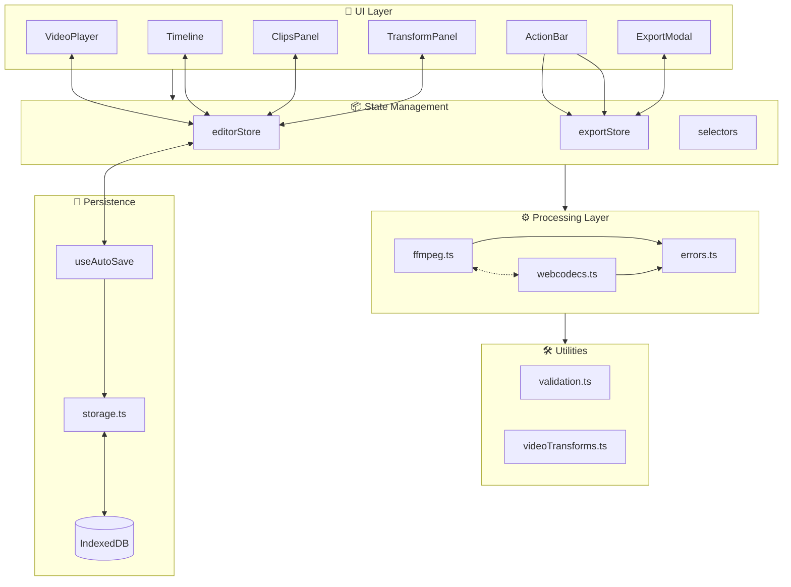
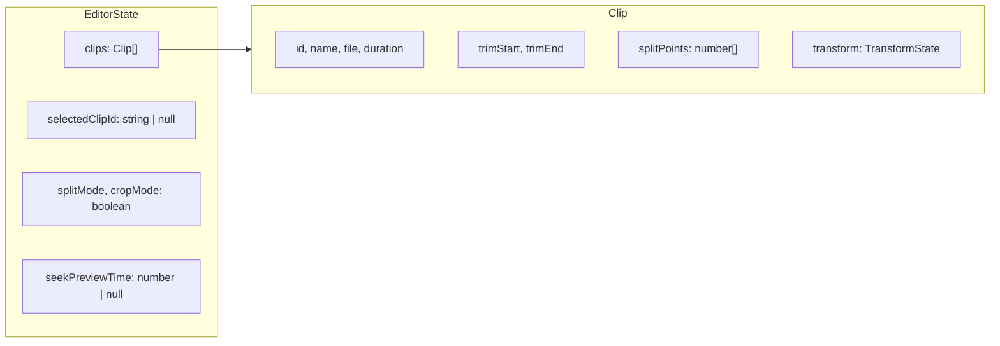
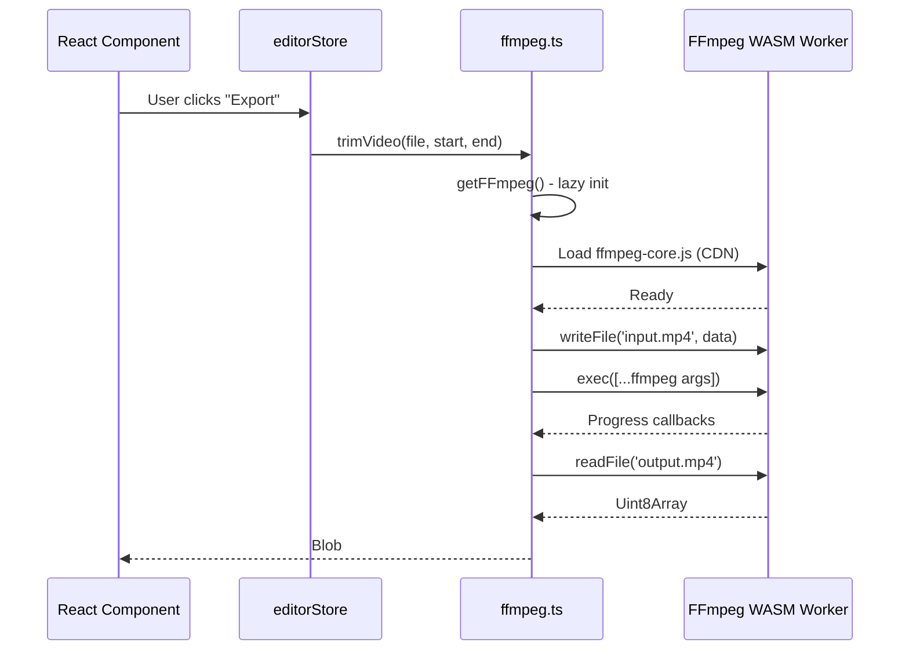
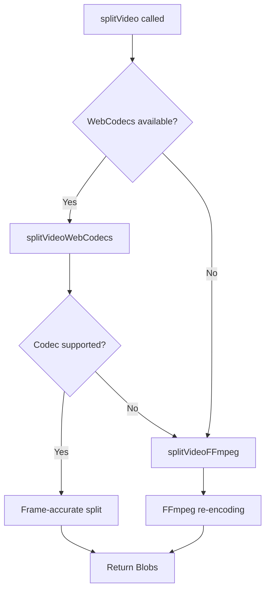
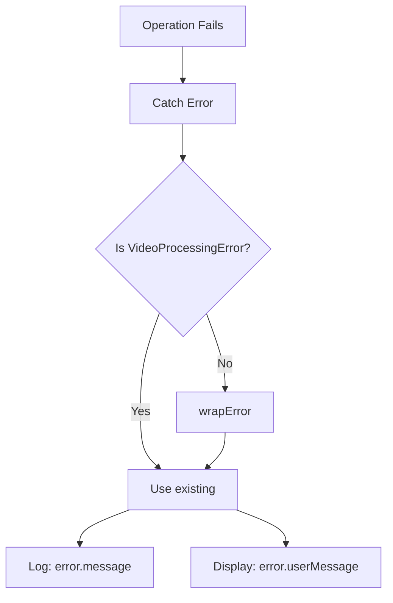
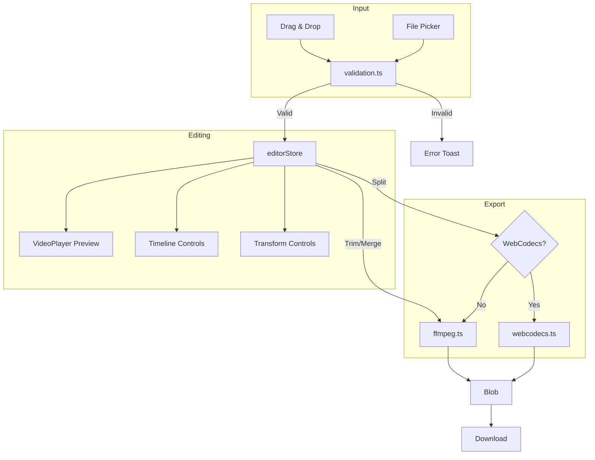

# VEdit Architecture

> Technical deep-dive into VEdit's system design, patterns, and implementation

---

## High-Level System Diagram



---

## Component Tree

```
App
├── Header                      # Logo, settings
├── main-content
│   ├── ClipsPanel             # Sidebar - clip thumbnails, import
│   │   ├── ClipThumbnail[]    # Draggable clip cards
│   │   └── AddClipButton      # Import trigger
│   └── editor-area
│       ├── VideoPlayer        # Preview with crop overlay
│       │   └── CropOverlay    # Draggable crop handles
│       ├── TransformPanel     # Rotate, flip, speed, aspect ratio
│       └── Timeline           # Scrubber, trim handles, split markers
│           ├── TrimHandles    # In/out point draggers
│           └── SplitMarkers   # Click-to-add markers
├── ActionBar                  # Trim, Split, Merge, Export buttons
└── ExportModal               # Progress indicator, download
```

---

## Zustand Store Structure

VEdit uses [Zustand](https://github.com/pmndrs/zustand) for lightweight, predictable state management.

### editorStore

Primary application state containing clips, selection, and editing modes.



**State Shape:**

| Property | Type | Description |
|----------|------|-------------|
| `clips` | `Clip[]` | All imported video clips |
| `selectedClipId` | `string \| null` | Currently selected clip |
| `isLoading` | `boolean` | Global loading state |
| `splitMode` | `boolean` | Timeline click adds split markers |
| `cropMode` | `boolean` | Shows crop overlay on video |
| `seekPreviewTime` | `number \| null` | Timeline-driven preview seek |

**Clip Shape:**

| Property | Type | Description |
|----------|------|-------------|
| `id` | `string` | Unique identifier |
| `file` | `File` | Original video file |
| `name` | `string` | Display name |
| `duration` | `number` | Video length in seconds |
| `thumbnailUrl` | `string \| null` | Generated preview image |
| `trimStart` / `trimEnd` | `number` | In/out points in seconds |
| `splitPoints` | `number[]` | Sorted split timestamps |
| `transform` | `TransformState` | Rotation, flip, crop, speed |

### TransformState

Per-clip transformation settings applied during export.

| Property | Type | Default | Description |
|----------|------|---------|-------------|
| `aspectRatio` | `AspectRatioPreset` | `'original'` | Target aspect ratio |
| `cropX/Y` | `number` | `0` | Normalized crop position (0-1) |
| `cropWidth/Height` | `number` | `1` | Normalized crop size (0-1) |
| `rotation` | `0\|90\|180\|270` | `0` | Clockwise rotation |
| `flipH` / `flipV` | `boolean` | `false` | Mirror horizontally/vertically |
| `speed` | `0.5\|0.75\|1\|1.5\|2` | `1` | Playback speed multiplier |

### Memoized Selectors

Located in `store/selectors.ts`, these prevent unnecessary re-renders:

| Selector | Returns | Purpose |
|----------|---------|---------|
| `useSelectedClip()` | `Clip \| undefined` | Current clip object |
| `useHasClips()` | `boolean` | Any clips loaded? |
| `useCanMerge()` | `boolean` | 2+ clips exist? |
| `useCanSplit()` | `boolean` | Selected clip has split points? |
| `useSplitMode()` | `boolean` | Split mode active? |
| `useCropMode()` | `boolean` | Crop mode active? |

---

## FFmpeg WASM Integration

VEdit uses [@ffmpeg/ffmpeg](https://github.com/ffmpegwasm/ffmpeg.wasm) for client-side video processing.

### Architecture Pattern



### Lazy Initialization

FFmpeg is loaded on-demand to minimize initial bundle size:

```typescript
let ffmpeg: FFmpeg | null = null
let loadPromise: Promise<FFmpeg> | null = null

async function getFFmpeg(onProgress?): Promise<FFmpeg> {
    if (ffmpeg) return ffmpeg
    if (loadPromise) return loadPromise
    
    loadPromise = (async () => {
        const instance = new FFmpeg()
        await instance.load({
            coreURL: await toBlobURL('.../ffmpeg-core.js', 'text/javascript'),
            wasmURL: await toBlobURL('.../ffmpeg-core.wasm', 'application/wasm'),
        })
        ffmpeg = instance
        return instance
    })()
    
    return loadPromise
}
```

### FFmpeg Command Patterns

| Operation | Key Arguments |
|-----------|---------------|
| **Trim** | `-ss {start} -to {end} -c:v libx264 -preset ultrafast -crf 23` |
| **Split** | Same as trim, called per-segment |
| **Merge** | `-f concat -safe 0 -i list.txt` |
| **Transform** | `-vf "rotate=...,scale=...,crop=..."` |

### Filter Chain Builder

Transforms are applied via FFmpeg filter graphs in this order:
1. **Speed** → `setpts=PTS/{speed}` (video), `atempo={speed}` (audio)
2. **Rotation** → `transpose=` or `rotate=`
3. **Flip** → `hflip` / `vflip`
4. **Crop** → `crop=w:h:x:y`
5. **Aspect Ratio** → `scale=...,pad=...`

---

## WebCodecs Fallback Strategy

VEdit implements a **progressive enhancement** strategy for video splitting:



### Why WebCodecs?

| Feature | FFmpeg WASM | WebCodecs |
|---------|-------------|-----------|
| Bundle size | ~30MB core | Native (0 KB) |
| Frame accuracy | Re-encode required | Exact frame selection |
| Speed | Slower (WASM) | Native performance |
| Browser support | All modern | Chrome 94+, Edge 94+ |

### WebCodecs Pipeline

```mermaid
flowchart LR
    subgraph Demux["1. Demux (mp4box.js)"]
        MP4[MP4 File] --> Tracks[Video + Audio Tracks]
        Tracks --> Samples[Encoded Samples]
    end
    
    subgraph Decode["2. Decode (WebCodecs)"]
        Samples --> VD[VideoDecoder]
        Samples --> AD[AudioDecoder]
        VD --> Frames[VideoFrame[]]
        AD --> Audio[AudioData[]]
    end
    
    subgraph Encode["3. Encode (WebCodecs)"]
        Frames --> VE[VideoEncoder]
        Audio --> AE[AudioEncoder]
        VE --> VChunks[EncodedVideoChunk[]]
        AE --> AChunks[EncodedAudioChunk[]]
    end
    
    subgraph Mux["4. Mux (mp4-muxer)"]
        VChunks --> Muxer
        AChunks --> Muxer
        Muxer --> Output[MP4 Blob]
    end
```

### Feature Detection

```typescript
function isWebCodecsSupported(): boolean {
    return (
        typeof VideoDecoder !== 'undefined' &&
        typeof VideoEncoder !== 'undefined' &&
        typeof AudioDecoder !== 'undefined' &&
        typeof AudioEncoder !== 'undefined'
    )
}
```

---


---

## Persistence Layer

VEdit implements **Project Persistence** to prevent data loss.

### Storage Strategy (`src/lib/storage.ts`)

- **Technology**: IndexedDB (via `idb` library)
- **Data Model**:
  - `StoredProject`: Metadata (ID, timestamps, selected clip).
  - `StoredClip`: Clip data with `File` objects converted to `Blob` for storage.
  - **Structure**:
    - `vedit-projects` (DB)
      - `project` (Store): Single entry for current project.
      - `clips` (Store): All clips, indexed by project ID.

### Auto-Save Mechanism (`src/hooks/useAutoSave.ts`)

- **Debounce**: Saves occur 2 seconds after the last state change.
- **Fail-Safe**: `beforeunload` event triggers an immediate (best-effort) save.
- **State Restoration**: On load, data is retrieved from IndexedDB and rehydrated into the Zustand store.

---

## CSS Module Organization

VEdit uses CSS Modules with a design token system for consistent, maintainable styling.

### File Structure

```
src/
├── styles/
│   ├── tokens.css          # Design tokens (CSS custom properties)
│   └── globals.css         # Reset, typography, utilities
└── components/
    └── ComponentName/
        ├── ComponentName.tsx
        ├── ComponentName.module.css
        └── index.ts
```

### Design Tokens

All design values are centralized in `tokens.css`:

| Category | Examples |
|----------|----------|
| **Colors** | `--color-bg-primary`, `--color-accent-primary` |
| **Typography** | `--font-sans`, `--font-size-md`, `--font-weight-semibold` |
| **Spacing** | `--space-1` through `--space-16` |
| **Borders** | `--radius-sm`, `--color-border` |
| **Shadows** | `--shadow-md`, `--shadow-glow-primary` |
| **Transitions** | `--transition-fast`, `--transition-normal` |
| **Z-Index** | `--z-modal`, `--z-toast` |
| **Layout** | `--header-height`, `--timeline-height` |

### Color Palette

```css
/* Background */
--color-bg-primary: #0d0d14;      /* Deep space black */
--color-bg-secondary: #1a1a2e;    /* Elevated surfaces */
--color-bg-glass: rgba(255, 255, 255, 0.03);

/* Accents */
--color-accent-primary: #00d4ff;   /* Cyan - interactive */
--color-accent-secondary: #ff00aa; /* Magenta - split mode */
--color-accent-success: #00ff88;   /* Green - confirmations */
--color-accent-warning: #ffaa00;   /* Orange - warnings */
```

### Component Pattern

Each component folder contains its CSS Module:

```tsx
// VideoPlayer.tsx
import styles from './VideoPlayer.module.css'

export function VideoPlayer() {
    return (
        <div className={styles.container}>
            <video className={styles.video} />
        </div>
    )
}
```

```css
/* VideoPlayer.module.css */
.container {
    background: var(--color-bg-secondary);
    border-radius: var(--radius-lg);
    padding: var(--space-4);
}

.video {
    width: 100%;
    border-radius: var(--radius-md);
}
```

---

## Error Handling

VEdit uses structured error handling via `VideoProcessingError`:



### Error Types

| Operation | User Message |
|-----------|--------------|
| `trim` | "Failed to trim the video. The file may be corrupted..." |
| `merge` | "Failed to merge videos. Ensure all clips have compatible formats..." |
| `split` | "Failed to split the video. Try reducing the number of split points." |
| `transform` | "Failed to apply transformations. Try simplifying the edits." |
| `load` | "Failed to load the video file. The file may be corrupted." |

---

## Data Flow Summary



---

## See Also

- [API Reference](./API.md) — Detailed function signatures
- [Design Document](./DESIGN.md) — UI/UX specifications
- [User Guide](./USER_GUIDE.md) — End-user documentation
- [Contributing](../CONTRIBUTING.md) — Development setup
