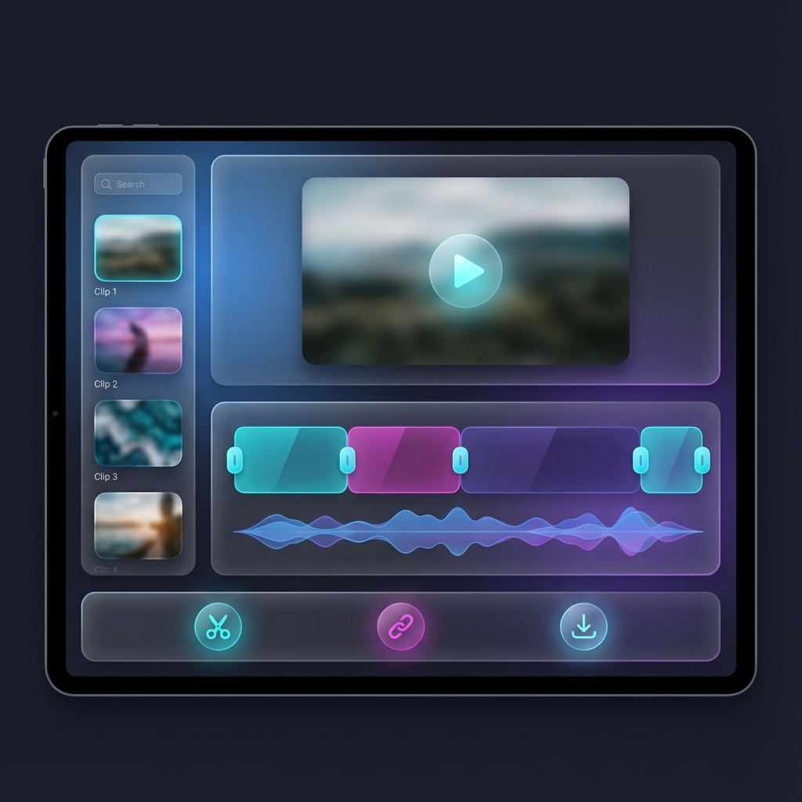
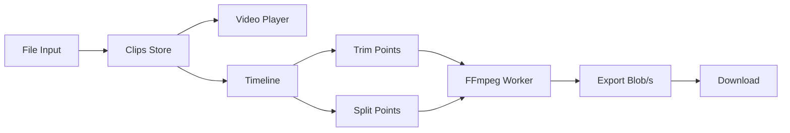
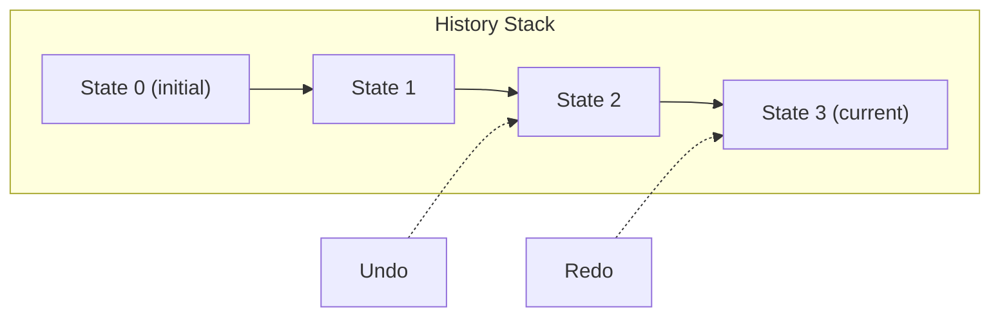
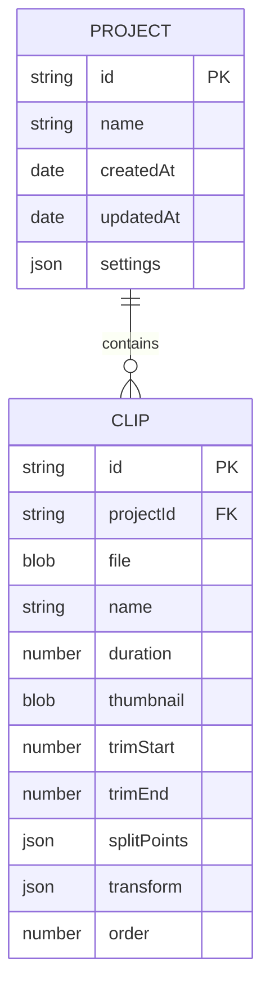

# VEdit - Product Design Document

> A lightweight, privacy-first video trimming, splitting, and merging PWA



## 🎯 Product Vision

**VEdit** is a browser-based video editor focused on doing core operations exceptionally well: **trimming**, **splitting**, and **merging** short video clips. Zero installation, zero uploads—all processing happens locally.

## Target User

- Content creators editing short-form videos
- Social media users trimming clips for sharing
- Anyone needing quick video edits without heavy software

## Core Features

| Feature | Description | Status |
|---------|-------------|--------|
| **Import** | Drag-drop or file picker, supports MP4/WebM/MOV | ✅ Done |
| **Trim** | Set in/out points, precise frame-level control | ✅ Done |
| **Split** | Mark split points visually, export as separate files | ✅ Done |
| **Merge** | Combine multiple clips in sequence | ✅ Done |
| **Preview** | Real-time playback of edits | ✅ Done |
| **Export** | MP4 output with H.264 encoding | ✅ Done |
| **Transform** | Aspect ratio, crop, rotate, flip | ✅ Done |
| **Speed** | 0.5x to 2x playback speed | ✅ Done |
| **WebCodecs** | Frame-accurate splitting (Chrome) | ✅ Done |
| **Testing** | 58 unit/integration tests | ✅ Done |
| **Undo/Redo** | Full edit history | 🔜 Planned |

## Design Principles

1. **Instant Gratification** — See results immediately, no waiting
2. **Privacy First** — All processing client-side, no server uploads
3. **Minimal Clicks** — Common tasks require minimal interaction
4. **Professional Feel** — Premium aesthetics inspire confidence

---

## 🎨 UI/UX Design

### Color Palette

```css
--bg-primary: #0d0d14;      /* Deep space black */
--bg-secondary: #1a1a2e;    /* Elevated surfaces */
--bg-glass: rgba(255,255,255,0.05); /* Glassmorphism */

--accent-primary: #00d4ff;   /* Cyan - interactive */
--accent-secondary: #ff00aa; /* Magenta - highlights */
--accent-success: #00ff88;   /* Green - confirmations */
--accent-warning: #ffaa00;   /* Orange - split mode */

--text-primary: #ffffff;
--text-secondary: #8888aa;
--text-muted: #555566;
```

### Typography

- **Headings:** Inter, semi-bold
- **Body:** Inter, regular
- **Monospace:** JetBrains Mono (timecodes)

### Layout Structure

```
┌────────────────────────────────────────────────────────────┐
│  VEdit                              [?] [⚙] [👤]   ← Header │
├────────────────────────────────────────────────────────────┤
│ ┌────────┐  ┌──────────────────────────────────────────┐   │
│ │        │  │                                          │   │
│ │ Clips  │  │           Video Preview                  │   │
│ │ Panel  │  │              16:9                        │   │
│ │        │  │                                          │   │
│ │ ─────  │  └──────────────────────────────────────────┘   │
│ │ Clip 1 │                                                 │
│ │ ─────  │  ┌──────────────────────────────────────────┐   │
│ │ Clip 2 │  │ ▶ 00:00:05 ──●────|──|────── 00:02:30    │   │
│ │ ─────  │  │ [=========██|██|██==================]    │   │
│ │  + Add │  │  ↑ In      Split markers     Out ↑       │   │
│ └────────┘  └──────────────────────────────────────────┘   │
│                 ✂️ Add Splits [toggle]   Splits: 2        │
├────────────────────────────────────────────────────────────┤
│  [✂️ Trim]  [✂️ Split → 3 parts]  [🔗 Merge]  [📤 Export] │
└────────────────────────────────────────────────────────────┘
```

### Interaction Patterns

| Action | Trigger | Feedback |
|--------|---------|----------|
| Add clip | Drag-drop or click "+" | Thumbnail appears in panel |
| Select clip | Click thumbnail | Cyan border, loads in preview |
| Set in-point | Drag left handle / press `I` | Yellow marker snaps |
| Set out-point | Drag right handle / press `O` | Yellow marker snaps |
| **Add split** | Toggle "Add Splits", click timeline | Magenta marker appears |
| **Remove split** | Click on split marker | Marker removed |
| Preview trim | Spacebar | Plays between in/out points |
| Merge | Click "Merge" with 2+ clips | Combined timeline view |
| **Split export** | Click "Split → N parts" | Progress modal → N downloads |
| Export | Click "Export" | Progress modal → download |

### Keyboard Shortcuts

| Key | Action |
|-----|--------|
| `Space` | Play/Pause |
| `J` / `K` / `L` | Rewind / Pause / Forward |
| `I` | Set in-point at playhead |
| `O` | Set out-point at playhead |
| `←` / `→` | Frame step |
| `⌘Z` / `Ctrl+Z` | Undo |
| `⌘⇧Z` / `Ctrl+Y` | Redo |
| `Delete` | Remove selected clip |

---

## 🏗️ Technical Architecture

### Tech Stack

| Layer | Technology | Rationale |
|-------|------------|-----------|
| **Build** | Vite 6 | Fast HMR, optimized builds |
| **UI** | React 19 + TypeScript | Component model, type safety |
| **State** | Zustand 5 | Lightweight, simple API |
| **Video** | ffmpeg.wasm 0.12+ | Browser-native FFmpeg |
| **Splitting** | WebCodecs + mp4box.js | Frame-accurate (with FFmpeg fallback) |
| **Styling** | Vanilla CSS + CSS Modules | Full control, no dependencies |
| **Testing** | Vitest + Testing Library | Fast, Vite-native testing |
| **PWA** | Vite PWA Plugin | Service worker, manifest |

### Project Structure

```
vedit/
├── public/
│   ├── manifest.json
│   └── icons/
├── src/
│   ├── components/
│   │   ├── VideoPlayer/
│   │   ├── Timeline/
│   │   ├── ClipsPanel/
│   │   ├── ActionBar/
│   │   └── ExportModal/
│   ├── hooks/
│   │   ├── useFFmpeg.ts
│   │   ├── useVideoPlayer.ts
│   │   └── useKeyboardShortcuts.ts
│   ├── store/
│   │   ├── editorStore.ts      # Clips, selection, splitPoints, splitMode
│   │   └── exportStore.ts
│   ├── lib/
│   │   ├── ffmpeg.ts           # trimVideo, splitVideo, mergeVideos
│   │   └── time.ts
│   ├── styles/
│   │   ├── tokens.css
│   │   ├── globals.css
│   │   └── components/
│   ├── App.tsx
│   └── main.tsx
├── docs/
│   ├── DESIGN.md
│   ├── TODO.md
│   └── PROGRESS.md
└── package.json
```

### Data Flow



### FFmpeg Commands

```typescript
// TRIM: Extract segment with re-encoding (frame accurate)
ffmpeg.exec([
  '-i', 'input.mp4',
  '-ss', startTime,
  '-to', endTime,
  '-c:v', 'libx264', '-preset', 'ultrafast', '-crf', '23',
  '-c:a', 'aac', '-b:a', '128k',
  '-movflags', '+faststart',
  'output.mp4'
]);

// SPLIT: Multiple segments from split points
// For each [start, end] segment:
ffmpeg.exec([
  '-i', 'input.mp4',
  '-ss', start,
  '-to', end,
  '-c:v', 'libx264', '-preset', 'ultrafast', '-crf', '23',
  '-c:a', 'aac', '-b:a', '128k',
  '-movflags', '+faststart',
  'segment_N.mp4'
]);

// MERGE: Concatenate multiple clips
ffmpeg.exec([
  '-f', 'concat',
  '-safe', '0',
  '-i', 'list.txt',
  '-c:v', 'libx264', '-preset', 'ultrafast', '-crf', '23',
  '-c:a', 'aac', '-b:a', '128k',
  '-movflags', '+faststart',
  'merged.mp4'
]);

// ASPECT RATIO: Convert to 9:16 vertical with padding
ffmpeg.exec([
  '-i', 'input.mp4',
  '-vf', 'scale=1080:1920:force_original_aspect_ratio=decrease,pad=1080:1920:(ow-iw)/2:(oh-ih)/2',
  '-c:v', 'libx264', '-preset', 'ultrafast', '-crf', '23',
  '-c:a', 'aac', '-b:a', '128k',
  'output_vertical.mp4'
]);

// CROP: Center crop to 1:1 square
ffmpeg.exec([
  '-i', 'input.mp4',
  '-vf', 'crop=min(iw\\,ih):min(iw\\,ih)',
  '-c:v', 'libx264', '-preset', 'ultrafast', '-crf', '23',
  '-c:a', 'aac', '-b:a', '128k',
  'output_square.mp4'
]);
```

---

## 📊 Performance Targets

| Metric | Target |
|--------|--------|
| First Contentful Paint | < 1.5s |
| Time to Interactive | < 3s |
| FFmpeg load time | < 2s (cached) |
| Trim (1min clip) | < 15s |
| Split (3 segments) | < 45s |
| Merge (3 clips) | < 30s |
| Export (5min @ 1080p) | < 2min |

---

## 🔒 Privacy & Security

- **Zero server uploads** — All processing via WebAssembly
- **No analytics** — Completely private by default
- **Memory cleanup** — Blob URLs revoked after use
- **No cookies** — Stateless operation

---

## 📋 Feature Specifications

### Undo/Redo System

**Status:** 🔜 Planned (Priority: High)

VEdit will implement undo/redo using the **Command Pattern** with state snapshots.



**Architecture:**

| Component | Description |
|-----------|-------------|
| `HistoryManager` | Manages undo/redo stacks |
| `EditorCommand` | Interface for reversible operations |
| `StateSnapshot` | Serialized editor state |

**Command Pattern Interface:**

```typescript
interface EditorCommand {
    execute(): void
    undo(): void
    description: string  // For history panel
}

interface HistoryState {
    past: StateSnapshot[]
    future: StateSnapshot[]
    maxHistorySize: number  // Default: 50
}
```

**Tracked Operations:**

| Operation | Undoable | Notes |
|-----------|----------|-------|
| Add clip | ✅ | Restores previous clip list |
| Remove clip | ✅ | Restores clip + selection |
| Trim change | ✅ | Restores in/out points |
| Add/move split | ✅ | Restores splitPoints array |
| Transform change | ✅ | Restores transform state |
| Reorder clips | ✅ | Restores clip order |

**Memory Strategy:**

- Store minimal diffs, not full state
- Auto-prune history > 50 items
- Clear history on project reset

---

### Audio Editing

**Status:** 🔜 Planned (Priority: Medium)

Audio controls will be added to the `TransformPanel`.

**UI Mockup:**

```
┌────────────────────────────────────┐
│  🔊 Audio                          │
├────────────────────────────────────┤
│  Volume    [────●─────────] 75%   │
│  [ ] Mute audio                    │
│                                    │
│  🎵 Background Music               │
│  [+ Add Music Track]               │
│  ───────────────────               │
│  track.mp3        [🗑️]             │
│  Volume [────●────] 50%            │
│  [ ] Loop  [ ] Fade in/out         │
└────────────────────────────────────┘
```

**Clip Audio State:**

```typescript
interface AudioState {
    volume: number        // 0-100
    muted: boolean
    fadeIn: number        // seconds (0 = no fade)
    fadeOut: number       // seconds (0 = no fade)
}

interface BackgroundTrack {
    id: string
    file: File
    name: string
    volume: number        // 0-100
    startOffset: number   // When to start playing
    loop: boolean
    fadeIn: number
    fadeOut: number
}
```

**FFmpeg Implementation:**

| Effect | Filter |
|--------|--------|
| Volume | `-af "volume=0.75"` |
| Mute | `-an` (no audio) |
| Fade in | `-af "afade=t=in:d=2"` |
| Fade out | `-af "afade=t=out:st=58:d=2"` |
| Mix tracks | `-filter_complex "amix=inputs=2"` |

---

### Project Persistence

**Status:** 🔜 Planned (Priority: Medium)

Projects will auto-save to IndexedDB for crash recovery.

**IndexedDB Schema:**



**Storage API:**

```typescript
interface ProjectStorage {
    // Auto-save current project
    saveProject(): Promise<void>
    
    // Load most recent project
    loadLastProject(): Promise<Project | null>
    
    // List all saved projects
    listProjects(): Promise<ProjectSummary[]>
    
    // Delete a project
    deleteProject(id: string): Promise<void>
    
    // Export project as file
    exportProject(id: string): Promise<Blob>
    
    // Import project file
    importProject(file: File): Promise<Project>
}
```

**Auto-save Behavior:**

| Trigger | Action |
|---------|--------|
| Clip added/removed | Save after 1s debounce |
| Trim changed | Save after 2s debounce |
| Transform changed | Save after 2s debounce |
| Window close | Immediate save attempt |

**Storage Limits:**

| Limit | Value |
|-------|-------|
| Max project size | 500 MB |
| Max projects | 10 |
| Auto-cleanup | Delete oldest when full |

---

### Export Presets

**Status:** 🔜 Planned (Priority: Medium)

Quick export settings for common platforms.

**Preset Specifications:**

| Preset | Resolution | Aspect | Max Duration | Notes |
|--------|------------|--------|--------------|-------|
| **TikTok** | 1080×1920 | 9:16 | 10 min | Vertical, mobile |
| **Instagram Reels** | 1080×1920 | 9:16 | 90 sec | Vertical, mobile |
| **Instagram Feed** | 1080×1080 | 1:1 | 60 sec | Square |
| **YouTube** | 1920×1080 | 16:9 | Unlimited | Landscape |
| **YouTube Shorts** | 1080×1920 | 9:16 | 60 sec | Vertical |
| **Twitter/X** | 1280×720 | 16:9 | 2 min 20 sec | Lower bitrate |

**UI Integration:**

```
┌──────────────────────────────────────────┐
│  📤 Export                               │
├──────────────────────────────────────────┤
│  Quick Presets:                          │
│  [TikTok] [Reels] [YouTube] [Custom]     │
│                                          │
│  Resolution: 1080 × 1920                 │
│  Format: MP4 (H.264)                     │
│  Quality: High (CRF 23)                  │
│                                          │
│  ⚠️ Video is 2:30, max for Reels is 90s │
│                                          │
│        [Cancel]  [Export]                │
└──────────────────────────────────────────┘
```

**Preset Data Structure:**

```typescript
interface ExportPreset {
    id: string
    name: string
    icon: string
    resolution: { width: number; height: number }
    aspectRatio: AspectRatioPreset
    maxDuration: number | null  // null = unlimited
    maxFileSize: number | null  // bytes, for platform limits
    crf: number                 // Quality (18-28, lower = better)
    audiobitrate: number        // kbps
}
```

---

## 🚀 Future Roadmap

> Features beyond the current planning horizon

### Phase 3: Visual Effects
- Color filters (warm, cool, B&W, vintage)
- Brightness/contrast/saturation sliders
- Region blur/pixelate for privacy

### Phase 4: Overlays & Transitions
- Text overlays with custom fonts
- Transitions between clips (fade, wipe, slide)
- Watermark/logo placement
- Sticker/emoji support

### Phase 5: Cloud & Collaboration
- Cloud backup (optional Firebase)
- Share projects via link
- Collaborative editing

---

## 📐 Diagram Placeholders

> Diagrams to be added with visual assets

### UI Component Diagram

```
[ Placeholder: Component tree visualization ]
See docs/ARCHITECTURE.md for current Mermaid diagram
```

### State Flow Diagram

```
[ Placeholder: State machine visualization ]
See docs/ARCHITECTURE.md for data flow diagram
```

### Export Pipeline Diagram

```
[ Placeholder: Visual representation of FFmpeg/WebCodecs pipeline ]
See docs/ARCHITECTURE.md for processing architecture
```

---

## 📚 See Also

- [Architecture](./ARCHITECTURE.md) — Technical deep-dive into system design
- [API Reference](./API.md) — Complete function documentation
- [User Guide](./USER_GUIDE.md) — End-user documentation
- [Progress](./PROGRESS.md) — Development changelog
- [TODO](./TODO.md) — Development task tracking
